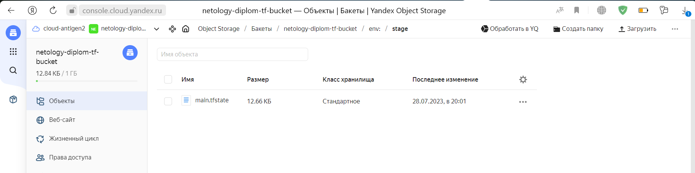
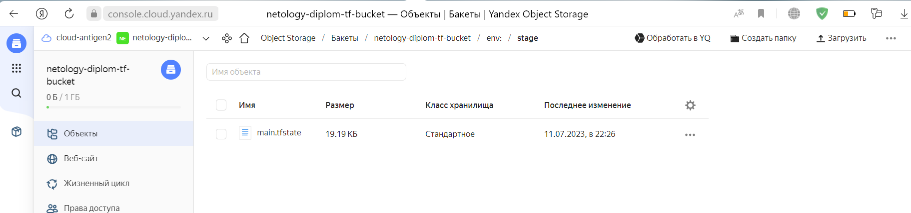
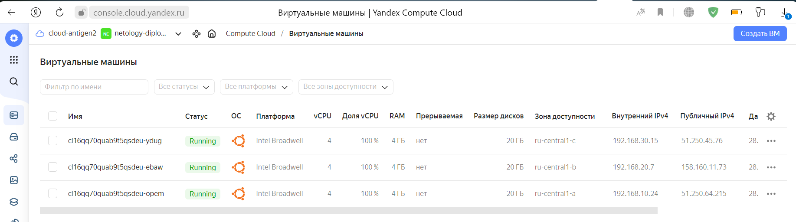
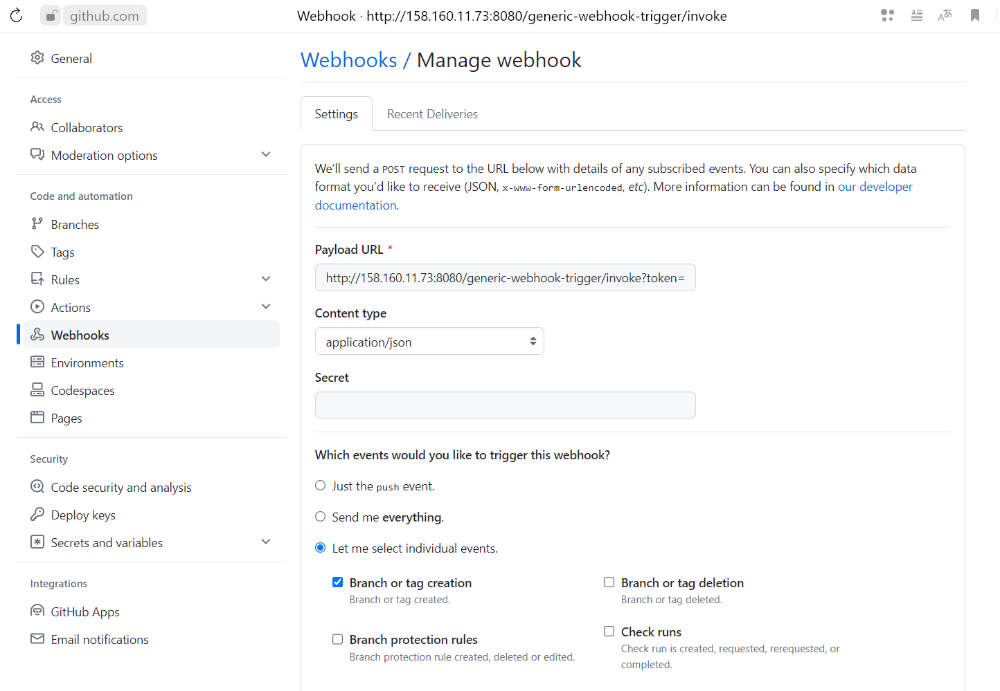

# Дипломный практикум в Yandex.Cloud
  * [Цели:](#цели)
  * [Этапы выполнения:](#этапы-выполнения)
     * [Создание облачной инфраструктуры](#создание-облачной-инфраструктуры)
     * [Создание Kubernetes кластера](#создание-kubernetes-кластера)
     * [Создание тестового приложения](#создание-тестового-приложения)
     * [Подготовка cистемы мониторинга и деплой приложения](#подготовка-cистемы-мониторинга-и-деплой-приложения)
     * [Установка и настройка CI/CD](#установка-и-настройка-cicd)
  * [Что необходимо для сдачи задания?](#что-необходимо-для-сдачи-задания)
  * [Как правильно задавать вопросы дипломному руководителю?](#как-правильно-задавать-вопросы-дипломному-руководителю)

---
## Цели:

1. Подготовить облачную инфраструктуру на базе облачного провайдера Яндекс.Облако.
2. Запустить и сконфигурировать Kubernetes кластер.
3. Установить и настроить систему мониторинга.
4. Настроить и автоматизировать сборку тестового приложения с использованием Docker-контейнеров.
5. Настроить CI для автоматической сборки и тестирования.
6. Настроить CD для автоматического развёртывания приложения.

---
## Этапы выполнения:


### Создание облачной инфраструктуры

> Для начала необходимо подготовить облачную инфраструктуру в ЯО при помощи [Terraform](https://www.terraform.io/).
> 
> Особенности выполнения:
> 
> - Бюджет купона ограничен, что следует иметь в виду при проектировании инфраструктуры и использовании ресурсов;
> - Следует использовать последнюю стабильную версию [Terraform](https://www.terraform.io/).
> 
> Предварительная подготовка к установке и запуску Kubernetes кластера.
> 
> 1. Создайте сервисный аккаунт, который будет в дальнейшем использоваться Terraform для работы с инфраструктурой с необходимыми и достаточными правами. Не стоит использовать права суперпользователя
> 2. Подготовьте [backend](https://www.terraform.io/docs/language/settings/backends/index.html) для Terraform:  
>    а. Рекомендуемый вариант: [Terraform Cloud](https://app.terraform.io/)  
>    б. Альтернативный вариант: S3 bucket в созданном ЯО аккаунте
> 3. Настройте [workspaces](https://www.terraform.io/docs/language/state/workspaces.html)  
>    а. Рекомендуемый вариант: создайте два workspace: *stage* и *prod*. В случае выбора этого варианта все последующие шаги должны учитывать факт существования нескольких workspace.  
>    б. Альтернативный вариант: используйте один workspace, назвав его *stage*. Пожалуйста, не используйте workspace, создаваемый Terraform-ом по-умолчанию (*default*).
> 4. Создайте VPC с подсетями в разных зонах доступности.
> 5. Убедитесь, что теперь вы можете выполнить команды `terraform destroy` и `terraform apply` без дополнительных ручных действий.
> 6. В случае использования [Terraform Cloud](https://app.terraform.io/) в качестве [backend](https://www.terraform.io/docs/language/settings/backends/index.html) убедитесь, что применение изменений успешно проходит, используя web-интерфейс Terraform cloud.
> 
> Ожидаемые результаты:
> 
> 1. Terraform сконфигурирован и создание инфраструктуры посредством Terraform возможно без дополнительных ручных действий.
> 2. Полученная конфигурация инфраструктуры является предварительной, поэтому в ходе дальнейшего выполнения задания возможны изменения.

Инициализируем профиль `yc`:
```shell
antigen@deb11notepad:~/diplom$ yc init
Welcome! This command will take you through the configuration process.
Pick desired action:
 [1] Re-initialize this profile 'netology-diplom-folder' with new settings
 [2] Create a new profile
 [3] Switch to and re-initialize existing profile: 'default'
 [4] Switch to and re-initialize existing profile: 'netology-diplom'
Please enter your numeric choice: 3
Please go to https://oauth.yandex.ru/authorize?response_type=token&client_id=xxxxxxxxxxxxxxxxxxxxxxxxxxxxxxx in order to obtain OAuth token.

Please enter OAuth token: [AQAAAAAAh*********************MXoQ8Nt9I] AQAAAAAAh*********************MXoQ8Nt9I
You have one cloud available: 'cloud-antigen2' (id = b1ghs08ptu2bcti61r3d). It is going to be used by default.
Please choose folder to use:
 [1] default (id = b1gebf7j46aqpmhmfucc)
 [2] netology-diplom (id = b1g7jq4ii6itii7aor67)
 [3] Create a new folder
Please enter your numeric choice: 3
Please enter a folder name: netology-diplom-folder
Your current folder has been set to 'netology-diplom-folder' (id = b1gp7o73uot437m5vlb2).
Do you want to configure a default Compute zone? [Y/n] y
Which zone do you want to use as a profile default?
 [1] ru-central1-a
 [2] ru-central1-b
 [3] ru-central1-c
 [4] Don't set default zone
Please enter your numeric choice: 3
Your profile default Compute zone has been set to 'ru-central1-c'.
```
Смотрим `id` нашего каталога и создаем для него сервисный аккаунт:
```shell
antigen@deb11notepad:~/diplom$ yc resource-manager folder list
+----------------------+------------------------+--------+----------+
|          ID          |          NAME          | LABELS |  STATUS  |
+----------------------+------------------------+--------+----------+
| b1gebf7j46aqpmhmfucc | default                |        | ACTIVE   |
| b1gp7o73uot437m5vlb2 | netology-diplom-folder |        | ACTIVE   |
+----------------------+------------------------+--------+----------+

antigen@deb11notepad:~/diplom$ yc iam service-account create --name netology-diplom-sa --folder-id b1gp7o73uot437m5vlb2 --description "service account for netology diplom"
id: ajevouvsv073vgg7im85
folder_id: b1gp7o73uot437m5vlb2
created_at: "2023-06-18T13:42:26.616958957Z"
name: netology-diplom-sa
description: service account for netology diplom
```
Смотрим `id` и даем права на каталог для сервисного аккаунта:
```shell
antigen@deb11notepad:~/diplom$ yc iam service-account list
+----------------------+--------------------+
|          ID          |        NAME        |
+----------------------+--------------------+
| ajevouvsv073vgg7im85 | netology-diplom-sa |
+----------------------+--------------------+

antigen@deb11notepad:~/diplom$ yc resource-manager folder add-access-binding netology-diplom-folder --role admin --subject serviceAccount:ajevouvsv073vgg7im85

done (6s)
effective_deltas:
  - action: ADD
    access_binding:
      role_id: admin
      subject:
        id: ajevouvsv073vgg7im85
        type: serviceAccount
```
Создаем `key.json`:
```shell
antigen@deb11notepad:~/diplom$ yc iam key create --service-account-name netology-diplom-sa --output key.json
id: ajelkb46i6h9rmbu244r
service_account_id: ajevouvsv073vgg7im85
created_at: "2023-06-18T13:44:14.495372238Z"
key_algorithm: RSA_2048
```
Создаем ключ доступа бакета:
```shell
antigen@deb11notepad:~/diplom/terraform$ yc iam service-account list
+----------------------+--------------------+
|          ID          |        NAME        |
+----------------------+--------------------+
| ajevouvsv073vgg7im85 | netology-diplom-sa |
+----------------------+--------------------+

antigen@deb11notepad:~/diplom/terraform$ yc iam access-key create --service-account-name netology-diplom-sa
access_key:
  id: ajeild368s2k6c8uikdb
  service_account_id: ajevouvsv073vgg7im85
  created_at: "2023-06-18T14:11:03.323358908Z"
  key_id: YCAJEYHVNCFAg3n580PNdDxYN
secret: YCOQxBcQ9rEg94JfbRrEGUcnE3vMG-5hH6uQmksI
```
Создаем `bucket` в ЯО:
```shell
antigen@deb11notepad:~/diplom$ yc storage bucket create \
  --name netology-diplom-tf-bucket \
  --default-storage-class STANDARD \
  --max-size 1073741824 \
  --public-read \
  --public-list \
  --public-config-read
name: netology-diplom-tf-bucket
folder_id: b1gp7o73uot437m5vlb2
anonymous_access_flags:
  read: false
  list: false
default_storage_class: STANDARD
versioning: VERSIONING_DISABLED
max_size: "1073741824"
acl: {}
created_at: "2023-06-18T14:16:46.466060Z"
```

Конфигурационные файлы `terraform`: \
Листинг `vars.tf`:
```terraform
# Переменная окружения TF_VAR_yc_token
variable "yc_token" {
  type = string
}

# Переменная окружения TF_VAR_yc_cloud_id
variable "yc_cloud_id" {
  type = string
}

# Переменная окружения TF_VAR_yc_folder_id
variable "yc_folder_id" {
  type = string
}

# Переменная окружения TF_VAR_yc_sa_id
variable "yc_sa_id" {
  type = string
}

variable "yc_zone" {
  type = list(string)
  default = [
    "ru-central1-a",
    "ru-central1-b",
    "ru-central1-c"
  ]
}

variable "private_ip" {
  type = list(list(string))
  default = [
    ["192.168.10.0/24"],
    ["192.168.20.0/24"],
    ["192.168.30.0/24"]
  ]
}

variable "ssh_key_pub" {
  default = "~/.ssh/id_ed25519.pub"
}

locals {
  res = {
    cores = {
      stage = 4
      prod  = 8
    }
    memory = {
      stage = 4
      prod  = 8
    }
  }
}
```
Листинг `networks.tf`:
```terraform
resource "yandex_vpc_network" "netology-diplom-network" {
  name = "netology-diplom-network"
}

resource "yandex_vpc_subnet" "private" {
  name            = "private-subnet-${count.index}"
  count           = length(var.yc_zone)
  network_id      = yandex_vpc_network.netology-diplom-network.id
  v4_cidr_blocks  = var.private_ip[count.index]
  zone            = var.yc_zone[count.index]
}
```
Листинг `main.tf`:
```terraform
terraform {
  required_providers {
    yandex = {
      source = "yandex-cloud/yandex"
    }
  }
  required_version = ">= 0.13"

  backend "s3" {
    endpoint   = "storage.yandexcloud.net"
    bucket     = "netology-diplom-tf-bucket"
    region     = "ru-central1"
    key        = "main.tfstate"

    skip_region_validation      = true
    skip_credentials_validation = true
  }
}

provider "yandex" {
  token		= var.yc_token
  cloud_id	= var.yc_cloud_id
  folder_id	= var.yc_folder_id
}

# Образ
data "yandex_compute_image" "u2004" {
  family = "ubuntu-2004-lts"
}
```
Листинг `instances.tf`:
```terraform
resource "yandex_compute_instance_group" "node-group-01" {
  name = "node-group-01"
  folder_id = var.yc_folder_id
  service_account_id = var.yc_sa_id
  instance_template {
    platform_id   = "standard-v1"
    boot_disk {
      initialize_params {
        image_id  = data.yandex_compute_image.u2004.id
        type      = "network-nvme"
        size      = 20
      }
    }
    network_interface {
      nat = true
      subnet_ids = [
        yandex_vpc_subnet.private[0].id,
        yandex_vpc_subnet.private[1].id,
        yandex_vpc_subnet.private[2].id
      ]
    }
    resources {
      cores  = local.res.cores[terraform.workspace]
      memory = local.res.memory[terraform.workspace]
    }

    metadata = {
      ssh-keys = "ubuntu:${file(var.ssh_key_pub)}"
    }
  }
  # создаст группу с необходимым количеством ВМ
  scale_policy {
    fixed_scale {
      size = 3
    }
  }

  allocation_policy {
    zones = var.yc_zone
  }

  deploy_policy {
    max_unavailable = 3
    max_creating    = 3
    max_expansion   = 3
    max_deleting    = 3
  }
}
```
Листинг `outputs.tf`:
```terraform
output "instance_info" {
  value = {
    external_ip_address = yandex_compute_instance_group.node-group-01.instances[*].network_interface[0].nat_ip_address
    internal_ip_address = yandex_compute_instance_group.node-group-01.instances[*].network_interface[0].ip_address
    name = yandex_compute_instance_group.node-group-01.instances[*].name
  }
}

```
Инициализируем `terraform` и создадим воркспэйсы:
```shell
antigen@deb11notepad:~/diplom/terraform$ source .env
antigen@deb11notepad:~/diplom/terraform$ terraform init -backend-config="access_key=$S3_ACCESS_KEY" -backend-config="secret_key=$S3_SECRET_KEY"

Initializing the backend...

Successfully configured the backend "s3"! Terraform will automatically
use this backend unless the backend configuration changes.

Initializing provider plugins...
- Finding latest version of yandex-cloud/yandex...
- Installing yandex-cloud/yandex v0.94.0...
- Installed yandex-cloud/yandex v0.94.0 (unauthenticated)

Terraform has created a lock file .terraform.lock.hcl to record the provider
selections it made above. Include this file in your version control repository
so that Terraform can guarantee to make the same selections by default when
you run "terraform init" in the future.

Terraform has been successfully initialized!

You may now begin working with Terraform. Try running "terraform plan" to see
any changes that are required for your infrastructure. All Terraform commands
should now work.

If you ever set or change modules or backend configuration for Terraform,
rerun this command to reinitialize your working directory. If you forget, other
commands will detect it and remind you to do so if necessary.

antigen@deb11notepad:~/diplom/01$ terraform workspace list
* default

antigen@deb11notepad:~/diplom/terraform$ terraform workspace new prod
Created and switched to workspace "prod"!

You're now on a new, empty workspace. Workspaces isolate their state,
so if you run "terraform plan" Terraform will not see any existing state
for this configuration.
antigen@deb11notepad:~/diplom/terraform$ terraform workspace new stage
Created and switched to workspace "stage"!

You're now on a new, empty workspace. Workspaces isolate their state,
so if you run "terraform plan" Terraform will not see any existing state
for this configuration.
antigen@deb11notepad:~/diplom/terraform$ terraform workspace list
  default
  prod
* stage
```
Создаем инфраструктуру терраформом:
```shell
antigen@deb11notepad:~/diplom/01$ terraform apply --auto-approve
...

Apply complete! Resources: 5 added, 0 changed, 0 destroyed.

Outputs:

instance_info = {
  "external_ip_address" = tolist([
    "158.160.11.73",
    "51.250.45.76",
    "51.250.64.215",
  ])
  "internal_ip_address" = tolist([
    "192.168.20.7",
    "192.168.30.15",
    "192.168.10.24",
  ])
  "name" = tolist([
    "cl16qq70quab9t5qsdeu-ebaw",
    "cl16qq70quab9t5qsdeu-ydug",
    "cl16qq70quab9t5qsdeu-opem",
  ])
}
```
Смотрим, что появилось в бакете:

Смотрим в клауде:

---
### Создание Kubernetes кластера

> На этом этапе необходимо создать [Kubernetes](https://kubernetes.io/ru/docs/concepts/overview/what-is-kubernetes/) кластер на базе предварительно созданной инфраструктуры.   Требуется обеспечить доступ к ресурсам из Интернета.
> 
> Это можно сделать двумя способами:
> 
> 1. Рекомендуемый вариант: самостоятельная установка Kubernetes кластера.  
>    а. При помощи Terraform подготовить как минимум 3 виртуальных машины Compute Cloud для создания Kubernetes-кластера. Тип виртуальной машины следует выбрать самостоятельно с учётом требовании к производительности и стоимости. Если в дальнейшем поймете, что необходимо сменить тип инстанса, используйте Terraform для внесения изменений.  
>    б. Подготовить [ansible](https://www.ansible.com/) конфигурации, можно воспользоваться, например [Kubespray](https://kubernetes.io/docs/setup/production-environment/tools/kubespray/)  
>    в. Задеплоить Kubernetes на подготовленные ранее инстансы, в случае нехватки каких-либо ресурсов вы всегда можете создать их при помощи Terraform.
> 2. Альтернативный вариант: воспользуйтесь сервисом [Yandex Managed Service for Kubernetes](https://cloud.yandex.ru/services/managed-kubernetes)  
>   а. С помощью terraform resource для [kubernetes](https://registry.terraform.io/providers/yandex-cloud/yandex/latest/docs/resources/kubernetes_cluster) создать региональный мастер kubernetes с размещением нод в разных 3 подсетях      
>   б. С помощью terraform resource для [kubernetes node group](https://registry.terraform.io/providers/yandex-cloud/yandex/latest/docs/resources/kubernetes_node_group)
>   
> Ожидаемый результат:
> 
> 1. Работоспособный Kubernetes кластер.
> 2. В файле `~/.kube/config` находятся данные для доступа к кластеру.
> 3. Команда `kubectl get pods --all-namespaces` отрабатывает без ошибок.

Скачиваем `kubespray`. Распаковываем и ставим зависимости. Копируем `sample`. Все по инструкции:
```shell
antigen@deb11notepad:~/diplom$ git clone https://github.com/kubernetes-incubator/kubespray.git
antigen@deb11notepad:~/diplom$ cd kubespray/
antigen@deb11notepad:~/diplom/kubespray$ sudo pip3 install -r requirements.txt
antigen@deb11notepad:~/diplom/kubespray$ cp -r inventory/sample inventory/mycluster
```
Отредактируем `kubespray/inventroy/mycluster/group_vars/k8s_cluster/k8s_cluster.yaml`. Чтобы получить конфиг `admin.conf`.
```yaml
kubeconfig_localhost: true
```
Генерируем `inventory.yaml`:
```shell
antigen@deb11notepad:~/diplom/01/kubespray$ declare -a IP=(158.160.11.73 51.250.45.76 51.250.64.215)
antigen@deb11notepad:~/diplom/01/kubespray$ CONFIG_FILE=inventory/diplom-cluster/inventory.yaml python3 contrib/inventory_builder/inventory.py ${IP[@]}
DEBUG: Adding group all
DEBUG: Adding group kube_control_plane
DEBUG: Adding group kube_node
DEBUG: Adding group etcd
DEBUG: Adding group k8s_cluster
DEBUG: Adding group calico_rr
DEBUG: adding host node1 to group all
DEBUG: adding host node2 to group all
DEBUG: adding host node3 to group all
DEBUG: adding host node1 to group etcd
DEBUG: adding host node2 to group etcd
DEBUG: adding host node3 to group etcd
DEBUG: adding host node1 to group kube_control_plane
DEBUG: adding host node2 to group kube_control_plane
DEBUG: adding host node1 to group kube_node
DEBUG: adding host node2 to group kube_node
DEBUG: adding host node3 to group kube_node
```
Создаем на основе `inventory/diplom-cluster/inventory.yaml` файл `inventory/diplom-cluster/host.yaml`. Листинг `inventory/diplom-cluster/host.yaml`:
```yaml
all:
  hosts:
    master:
      ansible_host: 158.160.11.73
      ansible_user: ubuntu
      ip: 192.168.20.7
    node1:
      ansible_host: 51.250.45.76
      ansible_user: ubuntu
      ip: 192.168.30.15
    node2:
      ansible_host: 51.250.64.215
      ansible_user: ubuntu
      ip: 192.168.10.24
  children:
    kube_control_plane:
      hosts:
        master:
    kube_node:
      hosts:
        node1:
        node2:
    etcd:
      hosts:
        master:
    k8s_cluster:
      children:
        kube_control_plane:
        kube_node:
    calico_rr:
      hosts: {}
```
Раскатываем `kubespray`:
```shell
antigen@deb11notepad:~/diplom/kubespray$ ansible-playbook -u ubuntu -i inventory/mycluster/hosts.yaml  --become cluster.yml
...
PLAY RECAP ***************************************************************************************************************************************************************************
localhost                  : ok=3    changed=0    unreachable=0    failed=0    skipped=0    rescued=0    ignored=0
master                     : ok=781  changed=156  unreachable=0    failed=0    skipped=1275 rescued=0    ignored=7
node1                      : ok=509  changed=92   unreachable=0    failed=0    skipped=776  rescued=0    ignored=0
node2                      : ok=509  changed=92   unreachable=0    failed=0    skipped=775  rescued=0    ignored=0

Пятница 28 июля 2023  20:53:04 +0300 (0:00:00.127)       0:48:18.120 **********
===============================================================================
kubernetes-apps/ansible : Kubernetes Apps | Lay Down CoreDNS templates ------------------------------------------------------------------------------------------------------- 50.70s
kubernetes-apps/metrics_server : Metrics Server | Create manifests ----------------------------------------------------------------------------------------------------------- 47.62s
kubernetes/preinstall : Install packages requirements ------------------------------------------------------------------------------------------------------------------------ 46.24s
kubernetes-apps/ansible : Kubernetes Apps | Start Resources ------------------------------------------------------------------------------------------------------------------ 37.24s
network_plugin/calico : Start Calico resources ------------------------------------------------------------------------------------------------------------------------------- 34.85s
kubernetes/preinstall : Ensure kube-bench parameters are set ----------------------------------------------------------------------------------------------------------------- 34.73s
network_plugin/calico : Calico | Create calico manifests --------------------------------------------------------------------------------------------------------------------- 30.13s
bootstrap-os : Install dbus for the hostname module -------------------------------------------------------------------------------------------------------------------------- 28.24s
kubernetes-apps/metrics_server : Metrics Server | Apply manifests ------------------------------------------------------------------------------------------------------------ 27.80s
container-engine/containerd : containerd | Remove orphaned binary ------------------------------------------------------------------------------------------------------------ 25.95s
kubernetes-apps/ansible : Kubernetes Apps | Lay Down nodelocaldns Template --------------------------------------------------------------------------------------------------- 21.87s
container-engine/containerd : containerd | Ensure containerd directories exist ----------------------------------------------------------------------------------------------- 20.83s
policy_controller/calico : Create calico-kube-controllers manifests ---------------------------------------------------------------------------------------------------------- 20.72s
kubernetes/node : Modprobe Kernel Module for IPVS ---------------------------------------------------------------------------------------------------------------------------- 20.25s
kubernetes/preinstall : Create kubernetes directories ------------------------------------------------------------------------------------------------------------------------ 20.21s
kubernetes/preinstall : Preinstall | reload kubelet -------------------------------------------------------------------------------------------------------------------------- 20.04s
etcd : Check certs | Register ca and etcd admin/member certs on etcd hosts --------------------------------------------------------------------------------------------------- 19.67s
kubernetes/kubeadm : Join to cluster ----------------------------------------------------------------------------------------------------------------------------------------- 19.67s
download : download_container | Download image if required ------------------------------------------------------------------------------------------------------------------- 19.64s
container-engine/containerd : containerd | Unpack containerd archive --------------------------------------------------------------------------------------------------------- 19.17s
```
Заходим на мастера и проверяем кластер:
```shell
antigen@deb11notepad:~/diplom/kubespray$ ssh ubuntu@158.160.11.73
Welcome to Ubuntu 20.04.6 LTS (GNU/Linux 5.4.0-153-generic x86_64)

 * Documentation:  https://help.ubuntu.com
 * Management:     https://landscape.canonical.com
 * Support:        https://ubuntu.com/advantage
New release '22.04.2 LTS' available.
Run 'do-release-upgrade' to upgrade to it.

Last login: Fri Jul 28 17:52:52 2023 from 85.172.94.174
ubuntu@master:~$ mkdir .kube
ubuntu@master:~$ cp /etc/kubernetes/admin.conf .kube/config
ubuntu@master:~$ chmod 600 .kube/config
ubuntu@master:~$ kubectl get nodes -o wide
NAME     STATUS   ROLES           AGE   VERSION   INTERNAL-IP     EXTERNAL-IP   OS-IMAGE             KERNEL-VERSION      CONTAINER-RUNTIME
master   Ready    control-plane   22m   v1.26.5   192.168.20.7    <none>        Ubuntu 20.04.6 LTS   5.4.0-153-generic   containerd://1.7.1
node1    Ready    <none>          19m   v1.26.5   192.168.30.15   <none>        Ubuntu 20.04.6 LTS   5.4.0-153-generic   containerd://1.7.1
node2    Ready    <none>          19m   v1.26.5   192.168.10.24   <none>        Ubuntu 20.04.6 LTS   5.4.0-153-generic   containerd://1.7.1
ubuntu@master:~$ kubectl get pods -A
NAMESPACE     NAME                                      READY   STATUS    RESTARTS   AGE
kube-system   calico-kube-controllers-6dfcdfb99-j8zmg   1/1     Running   0          14m
kube-system   calico-node-hgpf5                         1/1     Running   0          15m
kube-system   calico-node-vk6rf                         1/1     Running   0          15m
kube-system   calico-node-xk77r                         1/1     Running   0          15m
kube-system   coredns-645b46f4b6-hs6q4                  1/1     Running   0          12m
kube-system   coredns-645b46f4b6-xpz8t                  1/1     Running   0          12m
kube-system   dns-autoscaler-659b8c48cb-tljnm           1/1     Running   0          12m
kube-system   kube-apiserver-master                     1/1     Running   1          21m
kube-system   kube-controller-manager-master            1/1     Running   2          21m
kube-system   kube-proxy-2745d                          1/1     Running   0          18m
kube-system   kube-proxy-cr9gr                          1/1     Running   0          18m
kube-system   kube-proxy-l7b27                          1/1     Running   0          18m
kube-system   kube-scheduler-master                     1/1     Running   1          21m
kube-system   metrics-server-69d9447b96-gkl8c           1/1     Running   0          10m
kube-system   nginx-proxy-node1                         1/1     Running   0          17m
kube-system   nginx-proxy-node2                         1/1     Running   0          17m
kube-system   nodelocaldns-5hkm7                        1/1     Running   0          12m
kube-system   nodelocaldns-t8kkv                        1/1     Running   0          12m
kube-system   nodelocaldns-zj6vf                        1/1     Running   0          12m
```
---
### Создание тестового приложения

> Для перехода к следующему этапу необходимо подготовить тестовое приложение, эмулирующее основное приложение разрабатываемое вашей компанией.
> 
> Способ подготовки:
> 
> 1. Рекомендуемый вариант:  
>    а. Создайте отдельный git репозиторий с простым nginx конфигом, который будет отдавать статические данные.  
>    б. Подготовьте Dockerfile для создания образа приложения.  
> 2. Альтернативный вариант:  
>    а. Используйте любой другой код, главное, чтобы был самостоятельно создан Dockerfile.
> 
> Ожидаемый результат:
> 
> 1. Git репозиторий с тестовым приложением и Dockerfile.
> 2. Регистр с собранным docker image. В качестве регистра может быть DockerHub или [Yandex Container Registry](https://cloud.yandex.ru/services/container-registry), созданный также с помощью terraform.

Создаем `Dockerfile`:
```shell
FROM nginx:1.24.0-alpine

LABEL   author="Gibadullin Ramil" \
        version="1.0.0" \
        description="Dockerfile for diplom DevOps in Netology"

ADD config /etc/nginx
ADD myhtml /usr/share/nginx/html
EXPOSE 80
```
Билдим его, логинемся к hub.docker.com и заливаем его:
```shell
docker build -t antigen2/app:1.0.0 .
docker login
docker push antigen2/app:1.0.0
```
[Репозиторий](https://github.com/antigen2/app)

[Образ](https://hub.docker.com/layers/antigen2/app/1.0.0/images/sha256-0ffca276b15ce0054f532e5374ff87d7d16c8add7c4a9c4342610b22318a48b2?context=repo)

---
### Подготовка cистемы мониторинга и деплой приложения

> Уже должны быть готовы конфигурации для автоматического создания облачной инфраструктуры и поднятия Kubernetes кластера.  
> Теперь необходимо подготовить конфигурационные файлы для настройки нашего Kubernetes кластера.
> 
> Цель:
> 1. Задеплоить в кластер [prometheus](https://prometheus.io/), [grafana](https://grafana.com/), [alertmanager](https://github.com/prometheus/alertmanager), [экспортер](https://github.com/prometheus/node_exporter) основных метрик Kubernetes.
> 2. Задеплоить тестовое приложение, например, [nginx](https://www.nginx.com/) сервер отдающий статическую страницу.
> 
> Рекомендуемый способ выполнения:
> 1. Воспользовать пакетом [kube-prometheus](https://github.com/prometheus-operator/kube-prometheus), который уже включает в себя [Kubernetes оператор](https://operatorhub.io/) для [grafana](https://grafana.com/), [prometheus](https://prometheus.io/), [alertmanager](https://github.com/prometheus/alertmanager) и [node_exporter](https://github.com/prometheus/node_exporter). При желании можете собрать все эти приложения отдельно.
> 2. Для организации конфигурации использовать [qbec](https://qbec.io/), основанный на [jsonnet](https://jsonnet.org/). Обратите внимание на имеющиеся функции для интеграции helm конфигов и [helm charts](https://helm.sh/)
> 3. Если на первом этапе вы не воспользовались [Terraform Cloud](https://app.terraform.io/), то задеплойте в кластер [atlantis](https://www.runatlantis.io/) для отслеживания изменений инфраструктуры.
> 
> Альтернативный вариант:
> 1. Для организации конфигурации можно использовать [helm charts](https://helm.sh/)
> 
> Ожидаемый результат:
> 1. Git репозиторий с конфигурационными файлами для настройки Kubernetes.
> 2. Http доступ к web интерфейсу grafana.
> 3. Дашборды в grafana отображающие состояние Kubernetes кластера.
> 4. Http доступ к тестовому приложению.

Ставить мониторинг будем с помощью `helm`.
```shell
ubuntu@master:~$ helm repo add prometheus-community https://prometheus-community.github.io/helm-charts
"prometheus-community" has been added to your repositories
ubuntu@master:~$ kubectl create namespace monitoring
namespace/monitoring created
ubuntu@master:~$ helm install stable prometheus-community/kube-prometheus-stack --namespace=monitoring
NAME: stable
LAST DEPLOYED: Fri Jul 28 18:02:39 2023
NAMESPACE: monitoring
STATUS: deployed
REVISION: 1
NOTES:
kube-prometheus-stack has been installed. Check its status by running:
  kubectl --namespace monitoring get pods -l "release=stable"

Visit https://github.com/prometheus-operator/kube-prometheus for instructions on how to create & configure Alertmanager and Prometheus instances using the Operator.
ubuntu@master:~$ kubectl --namespace monitoring get pods -l "release=stable"
NAME                                                   READY   STATUS    RESTARTS   AGE
stable-kube-prometheus-sta-operator-748f5565fd-tx6hl   1/1     Running   0          53s
stable-kube-state-metrics-77f66fdf8c-4j9vg             1/1     Running   0          53s
stable-prometheus-node-exporter-2mqn5                  1/1     Running   0          52s
stable-prometheus-node-exporter-9kzxn                  1/1     Running   0          52s
stable-prometheus-node-exporter-tqbk4                  1/1     Running   0          52s
```
Меняем тип сервиса `stable-grafana` с `ClusterIP` на `NodePort` для доступа к графане извне.
```shell
ubuntu@master:~$ kubectl patch -n monitoring svc stable-grafana -p '{"spec":{"type":"NodePort"}}'
service/stable-grafana patched
ubuntu@master:~$ kubectl get -n monitoring services
NAME                                      TYPE        CLUSTER-IP      EXTERNAL-IP   PORT(S)                      AGE
alertmanager-operated                     ClusterIP   None            <none>        9093/TCP,9094/TCP,9094/UDP   2m19s
prometheus-operated                       ClusterIP   None            <none>        9090/TCP                     2m19s
stable-grafana                            NodePort    10.233.50.128   <none>        80:31783/TCP                 2m29s
stable-kube-prometheus-sta-alertmanager   ClusterIP   10.233.9.91     <none>        9093/TCP,8080/TCP            2m29s
stable-kube-prometheus-sta-operator       ClusterIP   10.233.55.221   <none>        443/TCP                      2m29s
stable-kube-prometheus-sta-prometheus     ClusterIP   10.233.60.196   <none>        9090/TCP,8080/TCP            2m29s
stable-kube-state-metrics                 ClusterIP   10.233.54.36    <none>        8080/TCP                     2m29s
stable-prometheus-node-exporter           ClusterIP   10.233.38.82    <none>        9100/TCP                     2m29s
```
Теперь по любому внешнему ip:31783 есть доступ к графане.

Логин/пасс: `admin`/`prom-operator`:
- http://158.160.11.73:31783
- http://51.250.45.76:31783
- http://51.250.64.215:31783
---
### Установка и настройка CI/CD

> Осталось настроить ci/cd систему для автоматической сборки docker image и деплоя приложения при изменении кода.
> 
> Цель:
> 
> 1. Автоматическая сборка docker образа при коммите в репозиторий с тестовым приложением.
> 2. Автоматический деплой нового docker образа.
> 
> Можно использовать [teamcity](https://www.jetbrains.com/ru-ru/teamcity/), [jenkins](https://www.jenkins.io/), [GitLab CI](https://about.gitlab.com/stages-devops-lifecycle/continuous-integration/) или GitHub Actions.
> 
> Ожидаемый результат:
> 
> 1. Интерфейс ci/cd сервиса доступен по http.
> 2. При любом коммите в репозиторие с тестовым приложением происходит сборка и отправка в регистр Docker образа.
> 3. При создании тега (например, v1.0.0) происходит сборка и отправка с соответствующим label в регистр, а также деплой соответствующего Docker образа в кластер Kubernetes.

Будем использовать `Jenkins` в докере. Для этого сделаем по инструкции: [тыц](https://www.jenkins.io/doc/book/installing/docker/)

Создаем свой докер образ. Листинг `Dockerfile`:
```shell
FROM jenkins/jenkins:2.401.3-jdk17
USER root
RUN apt-get update && apt-get install -y lsb-release
RUN curl -fsSLo /usr/share/keyrings/docker-archive-keyring.asc \
  https://download.docker.com/linux/debian/gpg
RUN echo "deb [arch=$(dpkg --print-architecture) \
  signed-by=/usr/share/keyrings/docker-archive-keyring.asc] \
  https://download.docker.com/linux/debian \
  $(lsb_release -cs) stable" > /etc/apt/sources.list.d/docker.list
RUN apt-get update && apt-get install -y docker-ce-cli
USER jenkins
RUN jenkins-plugin-cli --plugins "blueocean docker-workflow"
```
Забилдим его и выгрузим [`DockerHub`](https://hub.docker.com/repository/docker/antigen2/myjenkins-blueocean/general):
```shell
docker build -t antigen2/myjenkins-blueocean:2.401.3-1 .
docker push antigen2/myjenkins-blueocean:2.401.3-1
```
Создадим скрипт `jenkins-install.sh`:
```shell
docker network create jenkins

docker volume create jenkins-docker-certs

docker volume create jenkins-data

docker run \
  --name jenkins-docker \
  --rm \
  --detach \
  --privileged \
  --network jenkins \
  --network-alias docker \
  --env DOCKER_TLS_CERTDIR=/certs \
  --volume jenkins-docker-certs:/certs/client \
  --volume jenkins-data:/var/jenkins_home \
  --publish 2376:2376 \
  docker:dind \
  --storage-driver overlay2

docker run \
  --name jenkins-blueocean \
  --restart=on-failure \
  --detach \
  --network jenkins \
  --env DOCKER_HOST=tcp://docker:2376 \
  --env DOCKER_CERT_PATH=/certs/client \
  --env DOCKER_TLS_VERIFY=1 \
  --publish 8080:8080 \
  --publish 50000:50000 \
  --volume jenkins-data:/var/jenkins_home \
  --volume jenkins-docker-certs:/certs/client:ro \
  antigen2/myjenkins-blueocean:2.401.3-1
```
Запускаем его:
```shell
sh jenkins-install.sh
```
Забираем ключ из логов для настройки `jenkins`:
```shell
ubuntu@master:~/jenkins$ docker logs jenkins-blueocean
Running from: /usr/share/jenkins/jenkins.war
webroot: /var/jenkins_home/war
2023-07-30 12:30:59.602+0000 [id=1]     INFO    winstone.Logger#logInternal: Beginning extraction from war file
2023-07-30 12:31:00.596+0000 [id=1]     WARNING o.e.j.s.handler.ContextHandler#setContextPath: Empty contextPath
2023-07-30 12:31:00.650+0000 [id=1]     INFO    org.eclipse.jetty.server.Server#doStart: jetty-10.0.13; built: 2022-12-07T20:13:20.134Z; git: 1c2636ea05c0ca8de1ffd6ca7f3a98ac084c766d; jvm 17.0.7+7
2023-07-30 12:31:00.884+0000 [id=1]     INFO    o.e.j.w.StandardDescriptorProcessor#visitServlet: NO JSP Support for /, did not find org.eclipse.jetty.jsp.JettyJspServlet
2023-07-30 12:31:00.941+0000 [id=1]     INFO    o.e.j.s.s.DefaultSessionIdManager#doStart: Session workerName=node0
2023-07-30 12:31:01.342+0000 [id=1]     INFO    hudson.WebAppMain#contextInitialized: Jenkins home directory: /var/jenkins_home found at: EnvVars.masterEnvVars.get("JENKINS_HOME")
2023-07-30 12:31:01.663+0000 [id=1]     INFO    o.e.j.s.handler.ContextHandler#doStart: Started w.@55e2fe3c{Jenkins v2.401.3,/,file:///var/jenkins_home/war/,AVAILABLE}{/var/jenkins_home/war}
2023-07-30 12:31:01.689+0000 [id=1]     INFO    o.e.j.server.AbstractConnector#doStart: Started ServerConnector@48a12036{HTTP/1.1, (http/1.1)}{0.0.0.0:8080}
2023-07-30 12:31:01.703+0000 [id=1]     INFO    org.eclipse.jetty.server.Server#doStart: Started Server@3eeb318f{STARTING}[10.0.13,sto=0] @2655ms
2023-07-30 12:31:01.705+0000 [id=27]    INFO    winstone.Logger#logInternal: Winstone Servlet Engine running: controlPort=disabled
2023-07-30 12:31:01.899+0000 [id=33]    INFO    jenkins.InitReactorRunner$1#onAttained: Started initialization
2023-07-30 12:31:02.341+0000 [id=35]    INFO    hudson.PluginManager#considerDetachedPlugin: Loading a detached plugin as a dependency: /var/jenkins_home/plugins/javax-mail-api.jpi
2023-07-30 12:31:04.522+0000 [id=38]    INFO    jenkins.InitReactorRunner$1#onAttained: Listed all plugins
2023-07-30 12:31:07.876+0000 [id=32]    INFO    jenkins.InitReactorRunner$1#onAttained: Prepared all plugins
2023-07-30 12:31:07.889+0000 [id=37]    INFO    jenkins.InitReactorRunner$1#onAttained: Started all plugins
2023-07-30 12:31:07.901+0000 [id=37]    INFO    jenkins.InitReactorRunner$1#onAttained: Augmented all extensions
2023-07-30 12:31:11.201+0000 [id=31]    INFO    jenkins.InitReactorRunner$1#onAttained: System config loaded
2023-07-30 12:31:11.202+0000 [id=31]    INFO    jenkins.InitReactorRunner$1#onAttained: System config adapted
2023-07-30 12:31:11.204+0000 [id=31]    INFO    jenkins.InitReactorRunner$1#onAttained: Loaded all jobs
2023-07-30 12:31:11.211+0000 [id=35]    INFO    jenkins.InitReactorRunner$1#onAttained: Configuration for all jobs updated
2023-07-30 12:31:11.256+0000 [id=52]    INFO    hudson.util.Retrier#start: Attempt #1 to do the action check updates server
2023-07-30 12:31:13.243+0000 [id=38]    INFO    jenkins.install.SetupWizard#init:

*************************************************************
*************************************************************
*************************************************************

Jenkins initial setup is required. An admin user has been created and a password generated.
Please use the following password to proceed to installation:

9ac36b7510cc49739b6a43932c7b184e

This may also be found at: /var/jenkins_home/secrets/initialAdminPassword

*************************************************************
*************************************************************
*************************************************************

2023-07-30 12:31:28.445+0000 [id=36]    INFO    jenkins.InitReactorRunner$1#onAttained: Completed initialization
2023-07-30 12:31:28.471+0000 [id=25]    INFO    hudson.lifecycle.Lifecycle#onReady: Jenkins is fully up and running
2023-07-30 12:31:28.958+0000 [id=52]    INFO    h.m.DownloadService$Downloadable#load: Obtained the updated data file for hudson.tasks.Maven.MavenInstaller
2023-07-30 12:31:28.958+0000 [id=52]    INFO    hudson.util.Retrier#start: Performed the action check updates server successfully at the attempt #1
```
`Jenkins` доступен по адресу: [http://158.160.11.73:8080/](http://158.160.11.73:8080/)

Логин/пасс: `gramm`/`123qweasd`

В репозиторий [app](https://github.com/antigen2/app) добавляем `app-deploy.yml`, `Jenkinsfile`.

Листинг `app-deploy.yml`:
```yaml
---
apiVersion: apps/v1
kind: Deployment
metadata:
  labels:
    app: app
  name: app
  namespace: stage
spec:
  replicas: 1
  selector:
    matchLabels:
      app: app
  template:
    metadata:
      labels:
        app: app
    spec:
      containers:
        - image: antigen2/app:latest
          imagePullPolicy: IfNotPresent
          name: app
      terminationGracePeriodSeconds: 30
---
apiVersion: v1
kind: Service
metadata:
  name: app
  namespace: stage
spec:
  ports:
    - name: web
      port: 80
      targetPort: 80
      nodePort: 30080
  selector:
    app: app
  type: NodePort
```
Листинг `Jenkinsfile`:
```shell
pipeline {
  environment {
    dockerimagename = "antigen2/app"
    dockerImage = ""
    
  }
  agent any
  stages {
    stage('Checkout Source') {
      steps {
        git branch: 'main', url: 'https://github.com/antigen2/app.git'
      }
    }
    stage('Checkout tag') {
      steps{
        script {
          sh 'git fetch'
          gitTag=sh(returnStdout:  true, script: "git tag --sort=-creatordate | head -n 1").trim()
          echo "gitTag output: ${gitTag}"
        }
      }
    }
    stage('Build image') {
      steps{
        script {
          dockerImage = docker.build dockerimagename
        }
      }
    }
    stage('Pushing Image:tags') {
      environment {
               registryCredential = 'dockerhub-credentials'
           }
      steps{
        script {
          docker.withRegistry( 'https://index.docker.io/v1/', registryCredential ) {
            dockerImage.push("${gitTag}")
            dockerImage.push("latest")
          }
        }
      }
    }
    stage('sed env') {
      environment {
              envTag = ("${gitTag}")
           }    
      steps{
        script {
          sh "sed -i \'18,22 s/gitTag/\'$envTag\'/g\' app-deploy.yml"
          sh 'cat app-deploy.yml'
        }
      }
    }
    stage('Apply Kubernetes files') {
      steps {
        withKubeConfig([
          credentialsId: 'k8s',
          namespace: 'stage']) {
            sh 'env'
            sh 'curl -LO "https://storage.googleapis.com/kubernetes-release/release/$(curl -s https://storage.googleapis.com/kubernetes-release/release/stable.txt)/bin/linux/amd64/kubectl"'
            sh 'chmod u+x ./kubectl'
            sh "./kubectl apply -f app-deploy.yml"
        }
      }
    }
  }
}    
```
В `gitlhub` в репозитории `app` создаем `webhook` для автоматического запуска сборки и деплоя приложения.


В `Jenkins` создаем необходимые креды для доступов в гит, докерхаб, кубер кластер.
---
## Что необходимо для сдачи задания?

1. Репозиторий с конфигурационными файлами Terraform и готовность продемонстрировать создание всех ресурсов с нуля.
2. Пример pull request с комментариями созданными atlantis'ом или снимки экрана из Terraform Cloud.
3. Репозиторий с конфигурацией ansible, если был выбран способ создания Kubernetes кластера при помощи ansible.
4. Репозиторий с Dockerfile тестового приложения и ссылка на собранный docker image.
5. Репозиторий с конфигурацией Kubernetes кластера.
6. Ссылка на тестовое приложение и веб интерфейс Grafana с данными доступа.
7. Все репозитории рекомендуется хранить на одном ресурсе (github, gitlab)

- Terraform: [https://github.com/antigen2/diplom-netology/tree/main/src/terraform](https://github.com/antigen2/diplom-netology/tree/main/src/terraform)
- Kubespray: [https://github.com/antigen2/diplom-netology/tree/main/src/kubespray](https://github.com/antigen2/diplom-netology/tree/main/src/kubespray)
- Dockerfile app: [https://github.com/antigen2/app/blob/main/Dockerfile](https://github.com/antigen2/app/blob/main/Dockerfile)
- DockerImage app: [https://hub.docker.com/layers/antigen2/app/1.0.0/images/sha256-0ffca276b15ce0054f532e5374ff87d7d16c8add7c4a9c4342610b22318a48b2?context=repo](https://hub.docker.com/layers/antigen2/app/1.0.0/images/sha256-0ffca276b15ce0054f532e5374ff87d7d16c8add7c4a9c4342610b22318a48b2?context=repo)
- K8s config: [https://github.com/antigen2/diplom-netology/tree/main/src/config](https://github.com/antigen2/diplom-netology/tree/main/src/config)
- App: [http://158.160.11.73:30080/](http://158.160.11.73:30080/)
- Jenkins: [http://158.160.11.73:8080/](http://158.160.11.73:8080/)
    - Логин/пасс: `gramm`/`123qweasd`
- Grafana: [http://158.160.11.73:31783](http://158.160.11.73:31783)
    - Логин/пасс: `admin`/`prom-operator`

---
